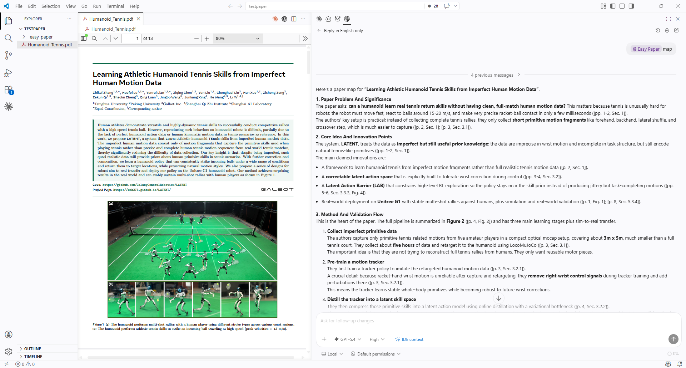
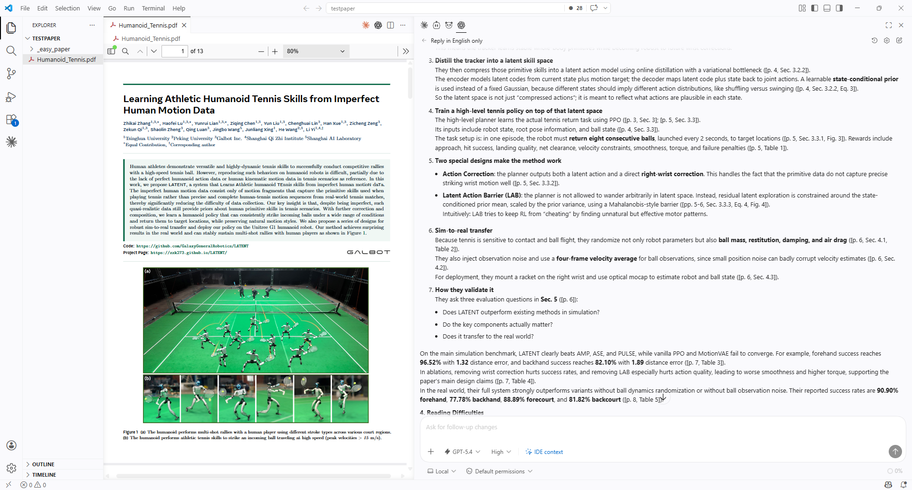
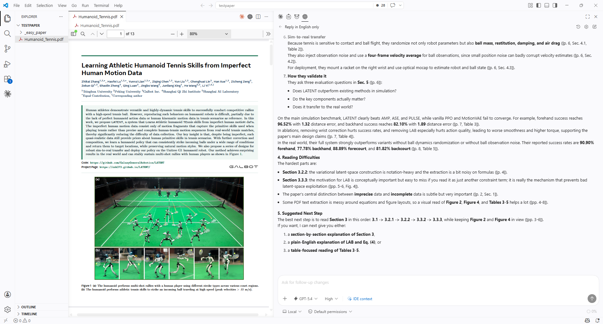
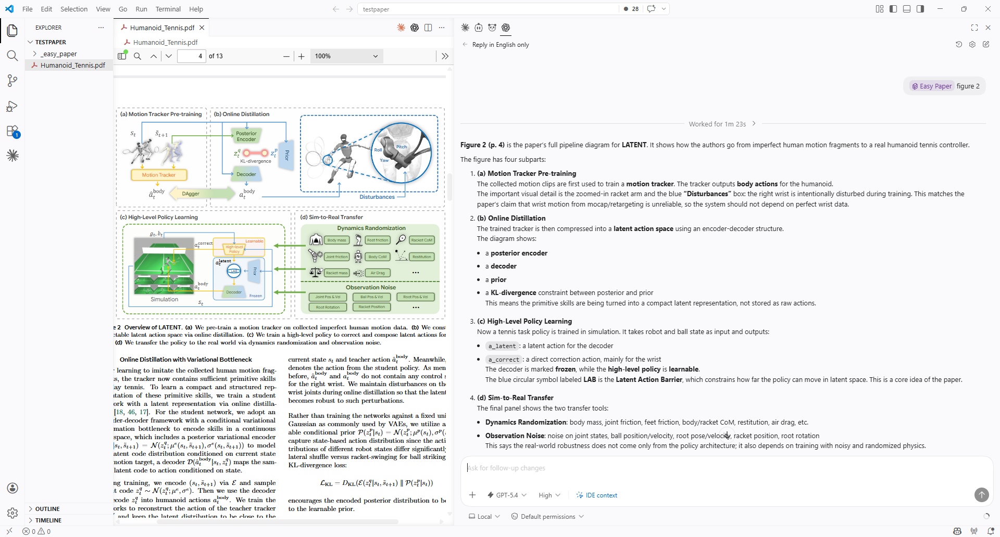
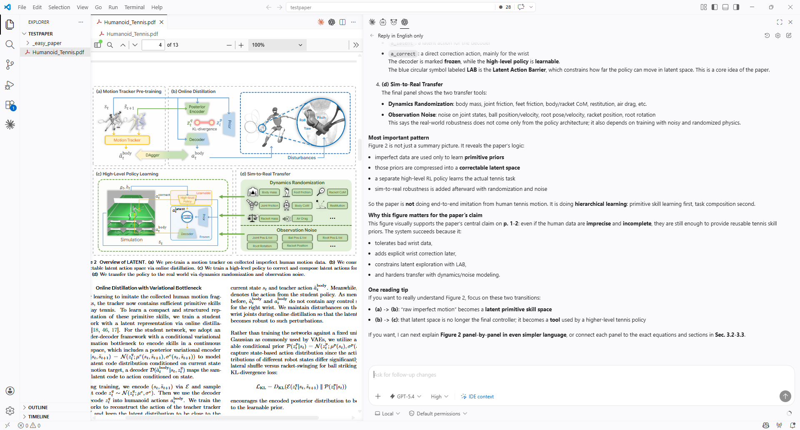
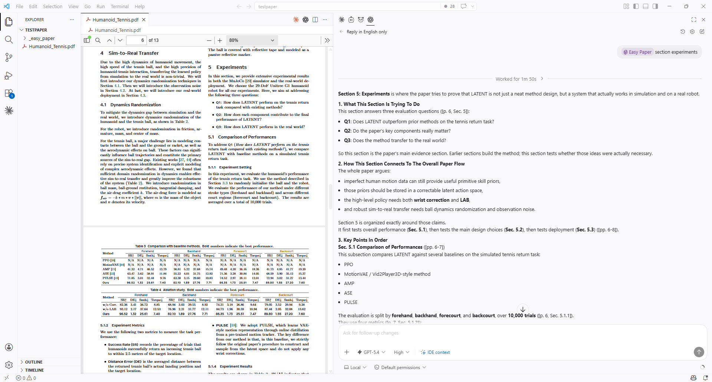
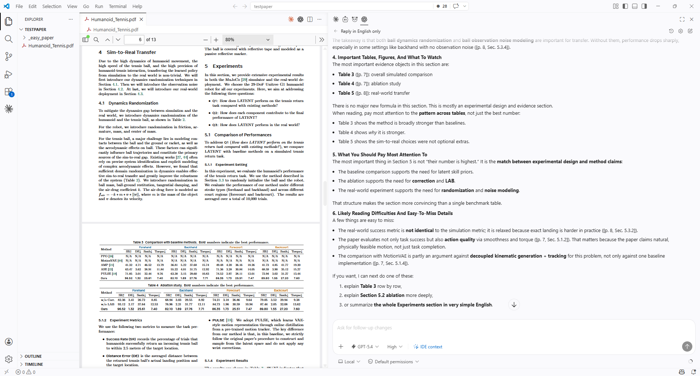
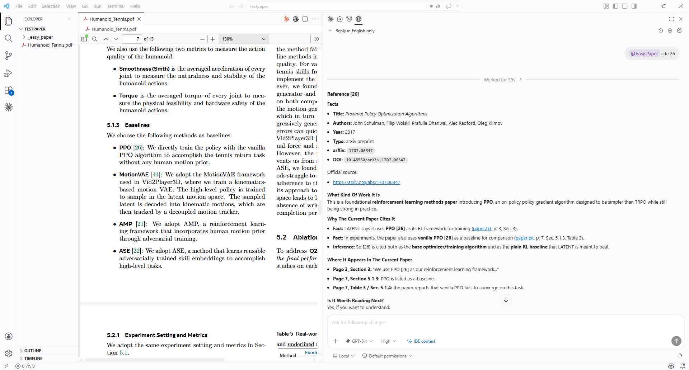

# Easy Paper

[中文](./README_CN.md)

Traditional paper reading is inefficient. Even when you feed a PDF directly into a web-based AI tool, the result is usually just a high-level summary for quick browsing, not a reading framework that truly supports careful study. This becomes especially painful when you are entering an unfamiliar research area and need to build understanding from scratch.

`easy-paper` helps readers quickly get oriented and then read a paper in depth through agent-based interaction. It can start with `map` to build a structured overview of the whole paper, then let the reader move deeper into `section`, `term`, `formula`, `figure`, `table`, `code`, and `cite` based on their actual reading needs. In practice, it solves two problems at once: how to enter a paper faster, and how to truly read it deeply.

## Why It's Different

- It recommends starting with `map` first, so you build structure before diving into details.
- It keeps location signals such as page numbers, sections, figures, tables, and equations whenever possible, so you can always jump back to the source.
- It supports mixed PDF, image, and text-based reading, so figures, tables, and local regions can also be explained independently.
- It is naturally suited for multi-turn follow-up, so you can move from the whole paper down to a single formula, term, or figure.

## Usage

`easy-paper` supports two ways of use. You can either use `/easy-paper` or `/ep` with a natural prompt such as "/easy-paper explain the first figure in this paper", or use `/easy-paper` or `/ep` together with a specific `mode`, such as "/easy-paper figure 1", to jump directly into a particular reading task.

```text
/easy-paper <mode>
/ep <mode>
```

`/easy-paper` is the main command, and `/ep` is the short alias.

## Modes

| Mode        | What it does                                       | Typical input                                  |
| ----------- | -------------------------------------------------- | ---------------------------------------------- |
| `map`     | Quickly builds a map of the whole paper            | `/easy-paper map`                            |
| `section` | Explains an abstract, section, or subsection       | `/easy-paper section 4.2 Experimental Setup` |
| `term`    | Explains unfamiliar terms in the paper's context   | `/easy-paper term xxxx`                      |
| `formula` | Explains formulas, losses, objectives, and updates | `/easy-paper formula 4`                      |
| `figure`  | Interprets a figure together with its context      | `/easy-paper figure 2`                       |
| `table`   | Interprets a table together with its context       | `/easy-paper table 3`                        |
| `code`    | Breaks down pseudocode or algorithm flow           | `/easy-paper code 1`                         |
| `cite`    | Explains a citation and generates useful links     | `/easy-paper cite 21`                        |
| `summary` | Turns the reading process into a structured note   | `/easy-paper summary`                        |

## Quick Start

Install `easy-paper` in your agent, such as Codex or Claude Code.

After opening a paper, start with `/easy-paper map` or `/ep map` to build a global view of the paper first. If your workspace contains multiple PDF files, make sure to specify the target file inside your agent.

Then continue with direct follow-up questions, or switch into modes such as `section`, `term`, `formula`, `figure`, `table`, `code`, or `cite` for deeper reading.

Once you finish reading, use `summary` to turn the whole interaction into a clean reading note.

The entire workflow happens through conversation. You do not need to keep rewriting long prompts or break the reading process into many manual steps.

## Installation

If your agent supports a `skills` directory, you can copy the whole repository into the corresponding skills path and keep a structure like this:

```text
easy-paper/
  SKILL.md
  README.md
  README_CN.md
  scripts/
  references/
  agents/
  image_CN/
  image_en/
```

For example, in Claude Code:

```bash
git clone https://github.com/cpsGGG/easy-paper.git ~/.claude/skills/easy-paper
```

For example, in Codex:

```bash
git clone https://github.com/cpsGGG/easy-paper.git ~/.codex/skills/easy-paper
```

After installation, you can invoke this skill with `/easy-paper` or `/ep`.

## Examples（Part）

### map

Below are actual examples of the `map` mode. The images are shown as thumbnails by default, and you can click them to open the full-size version.

<p align="center">
  <a href="./image_en/map1.png">
    
  </a>
  <a href="./image_en/map2.png">
    
  </a>
  <a href="./image_en/map3.png">
    
  </a>
</p>

### figure

Below are actual examples of the `figure` mode, showing how figure content is explained together with nearby paper context.

<p align="center">
  <a href="./image_en/figure1.png">
    
  </a>
  <a href="./image_en/figure2.png">
    
  </a>
</p>

### section

Below are actual examples of the `section` mode, which is useful for breaking down sections and expanding local parts of a paper.

<p align="center">
  <a href="./image_en/section1.png">
    
  </a>
  <a href="./image_en/section2.png">
    
  </a>
</p>

### cite

Below is an actual example of the `cite` mode, showing how citation details, roles in context, and useful links are organized.

<p align="center">
  <a href="./image_en/cite1.png">
    
  </a>
</p>

## Model Recommendation

Use a model with strong vision capabilities!!! For example, GPT-5.4 or Claude Opus 4.6 are good fits. Text-only models may make localization mistakes when reading figures, pages, or layout-heavy content. In general, stronger models produce more accurate and more complete explanations.
