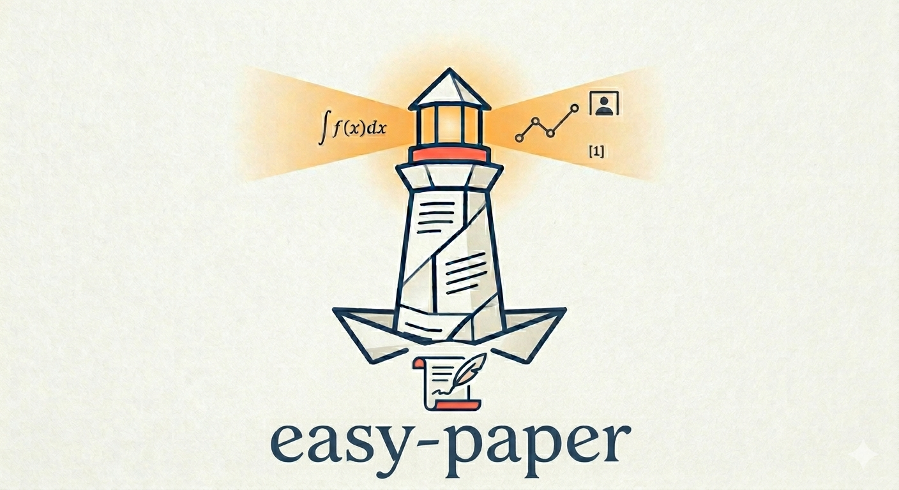
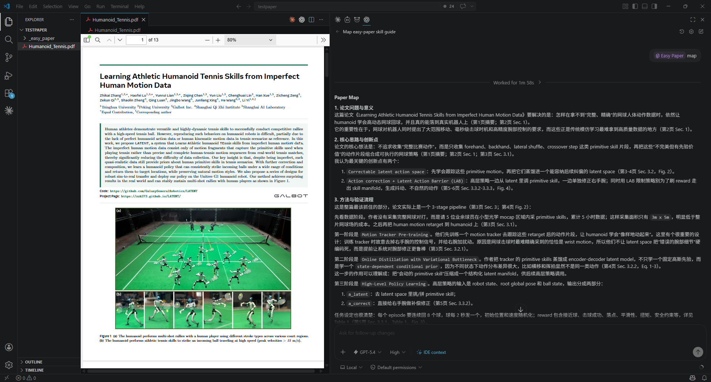
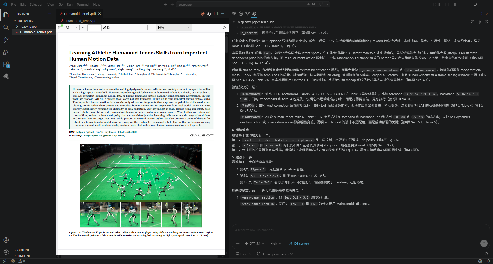
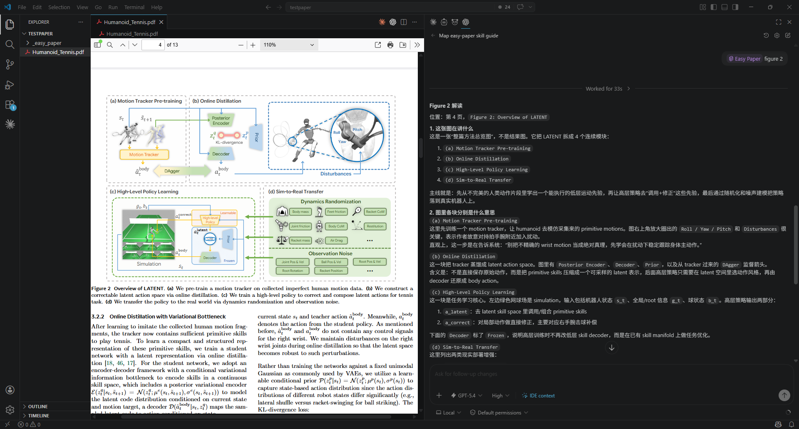
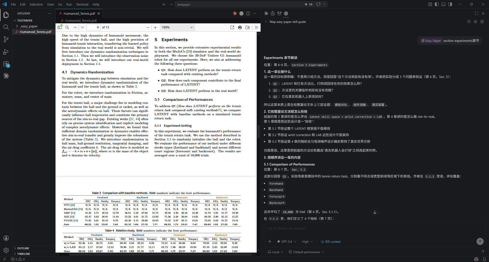
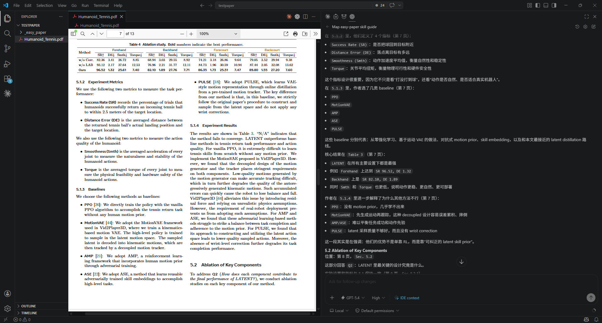
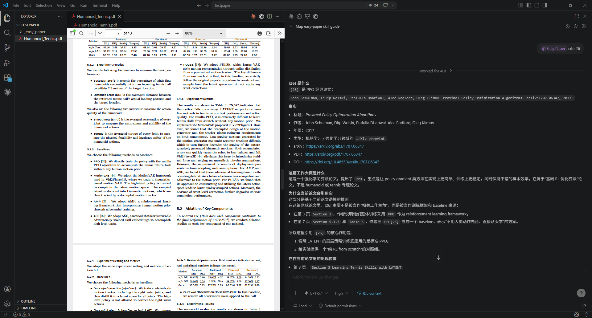
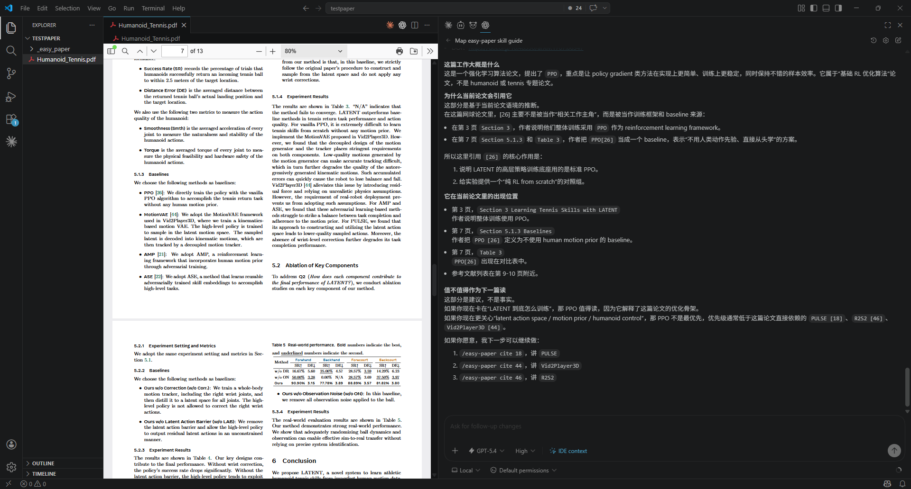

# Easy Paper

[English](./README.md)



传统的论文阅读方式是低效的。即便将 PDF 直接交给网页版 AI，通常得到的也只是面向快速浏览的概括性总结，而不是能够支撑精读的阅读框架。尤其当读者进入一个不熟悉的新领域时，阅读论文会花费大量时间。

`easy-paper` 可以让读者通过与agent交互实现对一篇文章的快速上手和论文精读。它可以先通过 `map` 帮助用户构建整篇论文的地图，再让用户根据自己的阅读需求，自主选择 `section`、`term`、`formula`、`figure`、`table`、`code` 与 `cite` 等关键节点深入展开。它同时解决两个问题：如何更快进入一篇论文，以及如何真正把一篇论文读深、读透。

## 为什么它不一样

- 推荐优先使用 map 功能，先建立结构，再进入细节
- 默认保留页码、章节、Figure、Table、Equation 等定位信息，读完还能回到原文
- 支持 PDF、图像文本混合阅读，图表和局部区域也能单独拆解
- 天然适合多轮追问，可以从整篇一路追到一个公式、一个术语或一张图表

## 使用方式

`easy-paper` 提供两种使用方式：用户既可以直接使用 `/easy-paper` 或 `/ep` 输入详细提示词，例如“/easy-paper 帮我解释这篇论文的第一张图”；也可以使用 `/easy-paper` 或 `/ep` 配合明确的 `mode` 词，如“/easy-paper figure 1”将请求直接定位到某一类阅读任务。

```text
/easy-paper <mode>
/ep <mode>
```

`/easy-paper` 是主命令，`/ep` 是短别名。

## Modes

| Mode        | 用来做什么                           | 典型输入                                       |
| ----------- | ------------------------------------ | ---------------------------------------------- |
| `map`     | 快速建立整篇论文地图                 | `/easy-paper map`                            |
| `section` | 讲清摘要、章节或子章节的内容         | `/easy-paper section 4.2 Experimental Setup` |
| `term`    | 结合全文解释读者陌生术语             | `/easy-paper term xxxx`                      |
| `formula` | 解释公式、loss、目标函数、更新规则等 | `/easy-paper formula 4`                      |
| `figure`  | 结合上下文解读图片                   | `/easy-paper figure 2`                       |
| `table`   | 结合上下文解读表格                   | `/easy-paper table 3`                        |
| `code`    | 梳理论文中伪代码的逻辑               | `/easy-paper code 1`                         |
| `cite`    | 解释引文，信息、跳转链接直接生成     | `/easy-paper cite 21`                        |
| `summary` | 把前面与ai交互的过程整理成一份笔记   | `/easy-paper summary`                        |

## 快速开始

在你的 agent 中安装 `easy-paper`，例如 Codex 或 Claude Code。

打开论文后，推荐直接输入 `/easy-paper map` 或 `/ep map`，先构建这篇论文的整体地图。如果文件夹里有多个pdf文件，记得在你的agent里面添加某一个文件以确定目标。

接下来，你可以继续直接提问，也可以切换到 `section`、`term`、`formula`、`figure`、`table`、`code` 或 `cite` 等 mode 深入阅读。

完成阅读后，建议再使用 `summary` 将整个过程整理成一份笔记。

整个过程通过对话完成，无需反复手写复杂 prompt，也不需要先把阅读流程拆成很多步骤。

## 安装

如果你使用的是支持 skills 目录的 agent，只需要将整个仓库复制到对应的 skills 目录，并保留以下结构：

```text
easy-paper/
  SKILL.md
  README.md
  README_CN.md
  scripts/
  references/
  agents/
```

例如在 Claude Code 中，你可以直接执行：

```bash
git clone https://github.com/cpsGGG/easy-paper.git ~/.claude/skills/easy-paper
```

例如在 Codex 中，你可以直接执行：

```bash
git clone https://github.com/cpsGGG/easy-paper.git ~/.codex/skills/easy-paper
```

安装完成后，即可通过 `/easy-paper` 或 `/ep` 调用这个技能。

## 使用案例（部分）

### map

<p align="center">
  <a href="./image_CN/map1.png">
    
  </a>
  <a href="./image_CN/map2.png">
    
  </a>
</p>

### figure

<p align="center">
  <a href="./image_CN/figure1.png">
    
  </a>
</p>

### section

<p align="center">
  <a href="./image_CN/section1.png">
    
  </a>
  <a href="./image_CN/section2.png">
    
  </a>
</p>

### cite

<p align="center">
  <a href="./image_CN/cite1.png">
    
  </a>
  <a href="./image_CN/cite2.png">
    
  </a>
</p>

## 模型推荐

一定要使用具备视觉理解能力的大模型！！！例如：gpt5.4，opus 4.6等， 文本模型可能会出现定位错误的问题，模型能力越强，解读越精准、全面。
